# Setup Email SMTP Settings for Office365 for OAuth2 Authentication
A step by step guideline for setting up MTP Settings for Office365 for OAuth2 Authentication

## Step-by-step: Register an application in Azure Active Directory
1.  Log into [Azure Portal](https://portal.azure.com/) and navigate to **Azure Active Directory** (AAD).
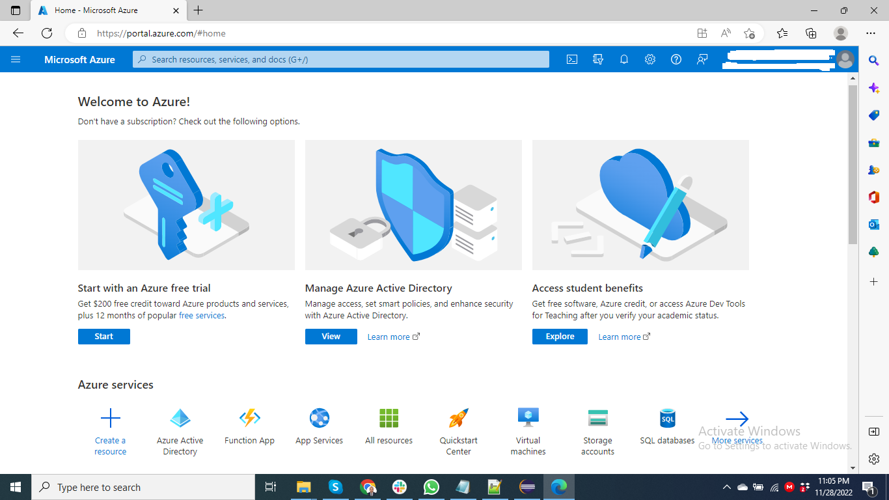

2. From the left menu, select **App registrations**.
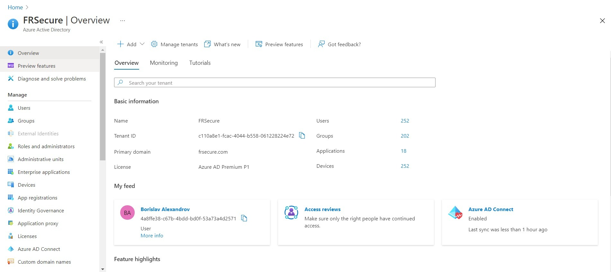

3. Click > **+New registration** above the application list. 
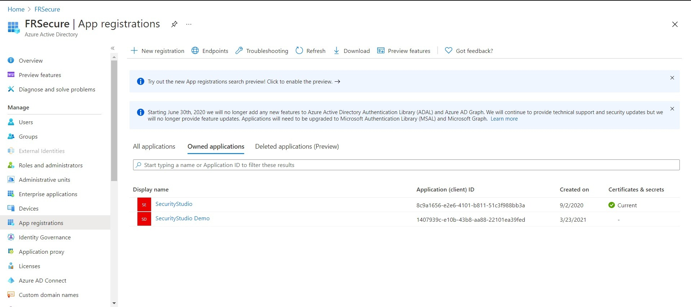

4. Provide **Application Name**.
5. Choose **Supported Account Types**.
6. Click > **Register** button. You will be automatically redirected to the new application settings page.
7. In the Essentials section at the top of the page, copy the following variables:
	- Application (Client) ID
	- Directory (Tenant) ID
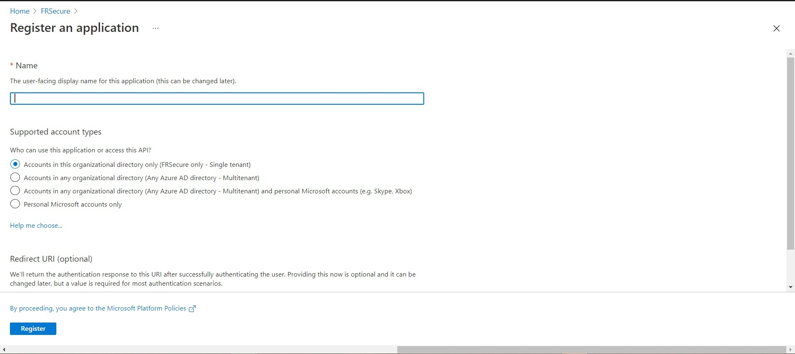
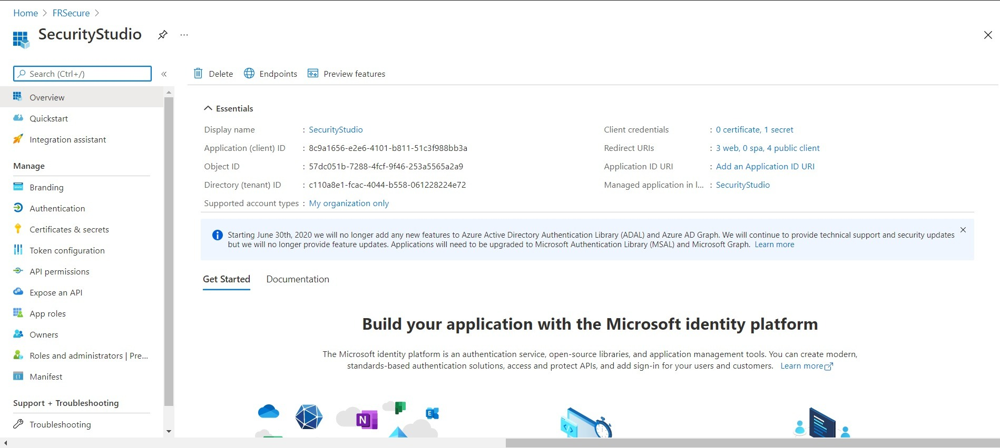

## Step-by-step: Provide API permissions to the registered application in **Azure Active Directory** 
By default, SMTP AUTH is disabled. We need to enable it for an account which will be used to send email through Office365 using OAuth2.
8. Go back to **Azure Portal > App Registrations > Your App**.

9. From the left menu, select **Authentication**. 

10. Choose **Yes** for **"Allow public client flows"**.
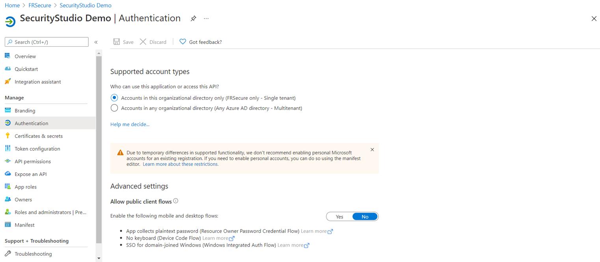

11. Click > **Save** button to apply the changes.

12. From the left menu, select **API Permissions**. 
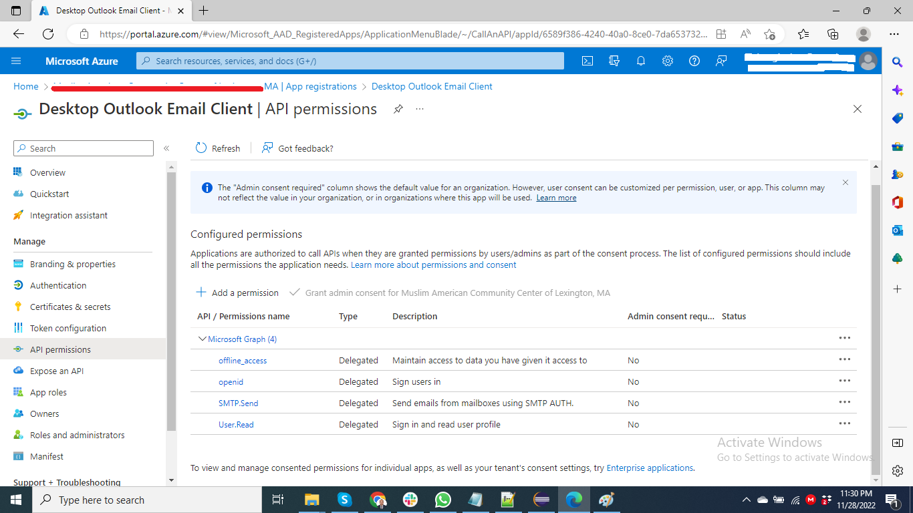

13. Choose **Microsoft Graph** in the right panel. 
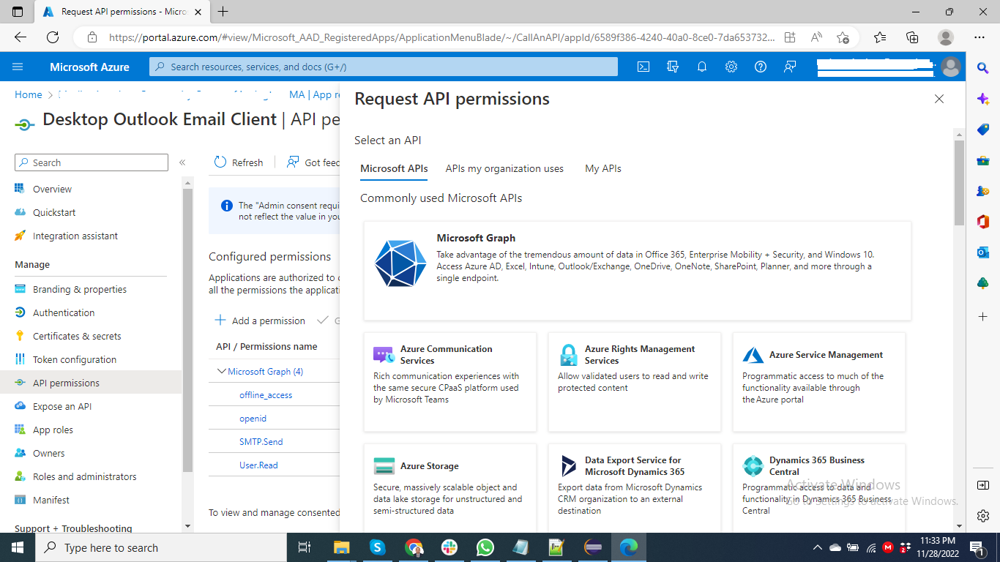
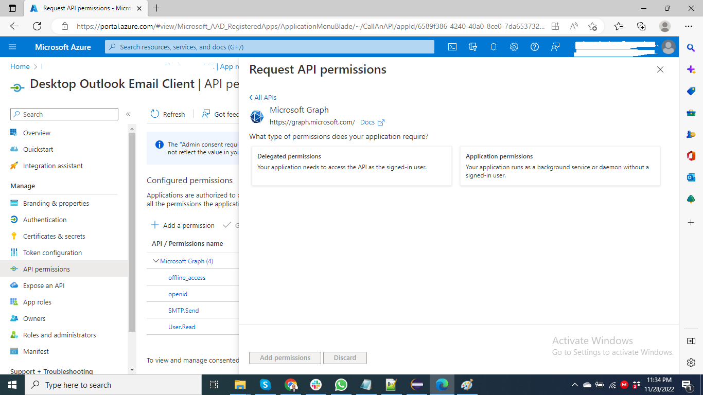

14. Select **SMTP.Send** in the **SMTP** section. 
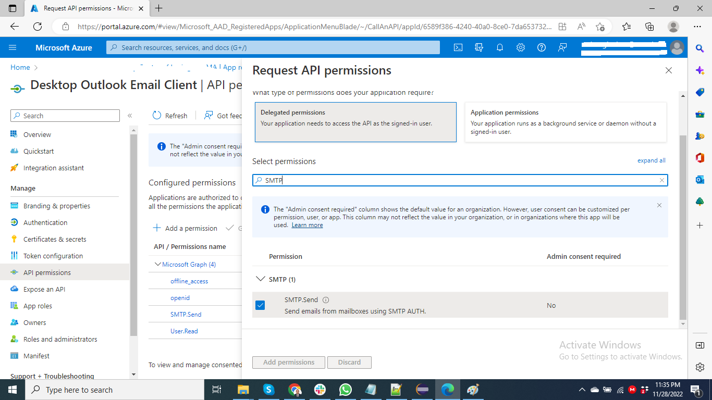

15. Select **openid** in the **openid** section. 
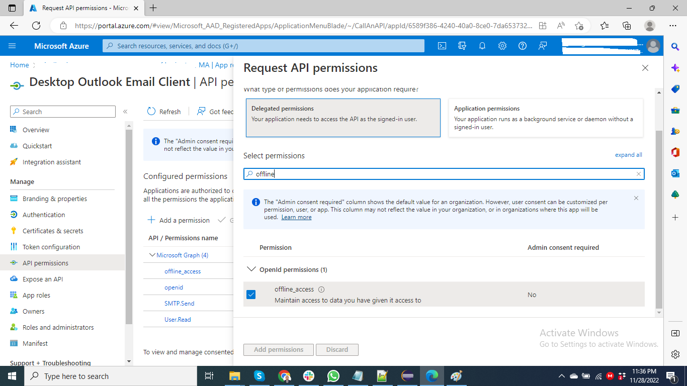

16. Select **offline_access** in the **offline_access** section. 

17. Select **User.read** in the **User** section. 

19. Click > **Add permissions** button. This will add two permissions to the application (see below).
 

## Step-by-step: Enable SMTP AUTH for specific mailboxes
By default, SMTP AUTH is disabled. We need to enable it for an account which will be used to send email through Office365 using OAuth2.

### Use the Microsoft 365 admin center to enable or disable SMTP AUTH on specific mailboxes
1. Open the [Microsoft 365 admin center](https://admin.microsoft.com/) and go to **Users > Active users**.

2. Select the user, and in the flyout that appears, click **Mail**.

3. In the **Email apps** section, click **Manage email apps**.

4. Verify the **Authenticated SMTP** setting: unchecked = disabled, checked = enabled.

5. When you're finished, click **Save changes**.

